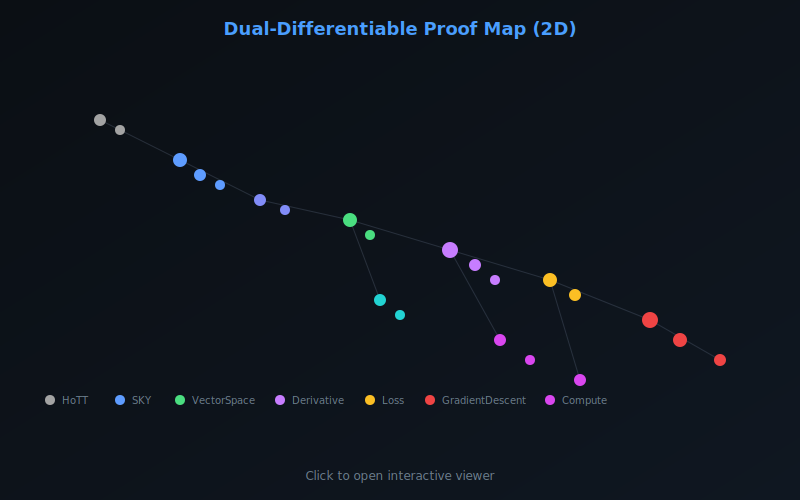
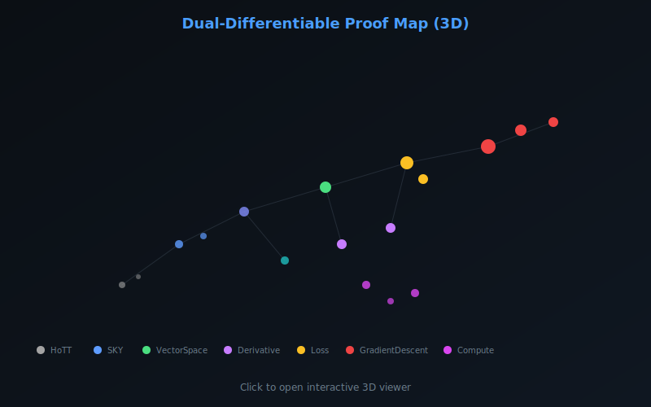

<sub><strong>Our tech stack is ontological:</strong><br>
<strong>Hardware — Physics</strong><br>
<strong>Software — Mathematics</strong><br><br>
<strong>Our engineering workflow is simple:</strong> discover, build, grow, learn & teach</sub>

---

<sub>
<strong>Notice of Proprietary Information</strong><br>
This document outlines foundational concepts and methodologies developed during internal research and development at Apoth3osis. To protect our intellectual property and adhere to client confidentiality agreements, the code, architectural details, and performance metrics presented herein may be simplified, redacted, or presented for illustrative purposes only. This paper is intended to share our conceptual approach and does not represent the full complexity, scope, or performance of our production-level systems. The complete implementation and its derivatives remain proprietary.
</sub>

---

# Dual-Differentiable: Gradient-Based Proof Synthesis in Lean 4

[](https://lean-lang.org/)
[](https://github.com/leanprover-community/mathlib4)
[](LICENSE)
[](RESEARCHER_BUNDLE/HeytingLean/)

## Credo

> *"The derivative of a proof is a proof of the derivative."*
> — **Thomas Ehrhard & Laurent Regnier** (paraphrased from Differential Linear Logic)

This project implements **Differential Linear Logic (DiLL)** semantics for SKY combinators, enabling gradient-based program synthesis. By vectorizing the combinator algebra into formal linear combinations and computing Jacobians of the rewrite rules, we can treat proof search as an optimization problem—descending the loss landscape to find programs that satisfy input/output specifications.

### Acknowledgment

We humbly thank the collective intelligence of humanity for providing the technology and culture we cherish. We do our best to properly reference the authors of the works utilized herein, though we may occasionally fall short. Our formalization acts as a reciprocal validation—confirming the structural integrity of their original insights while securing the foundation upon which we build. In truth, all creative work is derivative; we stand on the shoulders of those who came before, and our contributions are simply the next link in an unbroken chain of human ingenuity.

---

**Machine-checked formalization of Ehrhard-Regnier differentiation applied to SKY combinators, with a fully executable gradient descent synthesis loop.**

<table>
<tr>
<td align="center" width="50%">
<strong>2D Proof Map</strong><br/>
<em>Click to explore: pan, zoom, search declarations</em><br/>
<a href="https://abraxas1010.github.io/dual-differentiable-lean/RESEARCHER_BUNDLE/artifacts/visuals/differential_2d.html">
  
</a><br/>
<a href="https://abraxas1010.github.io/dual-differentiable-lean/RESEARCHER_BUNDLE/artifacts/visuals/differential_2d.html">▶ Open Interactive 2D Map</a>
</td>
<td align="center" width="50%">
<strong>3D Proof Map</strong><br/>
<em>Click to explore: rotate, zoom, click nodes</em><br/>
<a href="https://abraxas1010.github.io/dual-differentiable-lean/RESEARCHER_BUNDLE/artifacts/visuals/differential_3d.html">
  
</a><br/>
<a href="https://abraxas1010.github.io/dual-differentiable-lean/RESEARCHER_BUNDLE/artifacts/visuals/differential_3d.html">▶ Open Interactive 3D Map</a>
</td>
</tr>
</table>

## Why Differential Linear Logic for Combinators?

Traditional proof search explores a discrete space of rewrites. DiLL provides a **continuous relaxation**: instead of a single term `t`, we work with *formal linear combinations* `Σᵢ aᵢ · tᵢ` where coefficients `aᵢ` can be rational (or real). This enables:

1. **Vectorized Proofs**: Combinators become vectors in a coefficient space
2. **Differentiable Rewriting**: The S/K/Y rules extend linearly; their Jacobians are computable
3. **Gradient Descent Synthesis**: Given I/O examples, descend the loss to find satisfying programs
4. **Nucleus Stability**: Project solutions to fixed points for algebraic closure

## Key Results

| Theorem | Description | File |
|---------|-------------|------|
| `chainRule` | Exact chain rule for dual-number derivatives | `Derivative.lean:101` |
| `app_single_single` | Application of basis vectors produces basis | `LinearComb.lean:37` |
| `codereliction_is_derivative` | Codereliction = derivative of exponential | `Codereliction.lean:50` |
| `nucleusLinear_idempotent` | Linear extension preserves nucleus idempotence | `NucleusDifferential.lean:32` |
| `stepEdgesList_sound` | Enumerated edges are valid Step relations | `SKYMultiway.lean:146` |
| `stepEdges_complete` | All Step successors are enumerated | `SKYMultiway.lean:286` |

## Architecture

```
HeytingLean/
├── LoF/
│   ├── HoTT/Identity.lean          # HoTT-style identity types
│   └── Combinators/
│       ├── SKY.lean                # K, S, Y combinators + Step relation
│       ├── SKYMultiway.lean        # Multiway enumeration (stepEdgesList)
│       └── Differential/
│           ├── VectorSpace.lean    # FormalSum = Comb →₀ K
│           ├── LinearComb.lean     # Bilinear app, stepSum
│           ├── Derivative.lean     # Dual numbers, S_derivative
│           ├── Exponential.lean    # Exp V = ℕ →₀ V (bang modality)
│           ├── Codereliction.lean  # Linear increment lemma
│           ├── Loss.lean           # IOExample, coordinate gradients
│           ├── GradientDescent.lean# GDConfig, synthesize
│           ├── NucleusDifferential.lean # Nucleus projection
│           ├── SKYDerivatives.lean # K/S/Y Jacobians
│           ├── Compute.lean        # Executable FSum (Rat coefficients)
│           ├── Tests.lean          # Compile-time sanity checks
│           └── Demo.lean           # Demo configuration
└── CLI/
    └── DifferentialSKYDemoMain.lean # Runnable synthesis demo
```

## Quick Start

```bash
# Clone and build
git clone https://github.com/Abraxas1010/dual-differentiable-lean.git
cd dual-differentiable-lean/RESEARCHER_BUNDLE
lake update
lake build

# Run the gradient descent demo
lake exe differential_sky_demo
```

**Expected output:**
```
[differential_sky_demo] compute-backend demo (Rat coefficients)
x = [(1)·Y]
target y = [(2)·(K Y), (1)·(S Y)]
learned w = [(2)·K, (1)·S]
loss(w) = 0
stepSum((K (K S) Y)) = [(1)·(K S)]
```

## The Synthesis Pipeline

```
┌─────────────────┐
│  I/O Examples   │  input: Y  →  expected: 2·(K Y) + (S Y)
└────────┬────────┘
         ↓
┌─────────────────┐
│  Loss Function  │  L(w) = Σᵢ ‖w·xᵢ - yᵢ‖² + λ‖w‖²
└────────┬────────┘
         ↓
┌─────────────────┐
│ Coord Gradient  │  ∇ₜL = 2·⟨error, t·input⟩ for each basis term t
└────────┬────────┘
         ↓
┌─────────────────┐
│ Gradient Step   │  w' = w - η·∇L
└────────┬────────┘
         ↓
┌─────────────────┐
│ Project/Extract │  best term by |coefficient|
└─────────────────┘
```

## Theoretical Background

This formalization draws from:

- **Ehrhard & Regnier** — *Differential Linear Logic* (2003): The original DiLL semantics
- **Clift & Murfet** — *Derivatives of Turing Machines in Linear Logic* (2020): Jacobians of computation
- **Murfet** — *Geometry of Program Synthesis* (2022): Gradient descent on proof spaces

The key insight: the denotational semantics of linear logic proofs form a *differential category*, where composition has a well-defined derivative satisfying the chain rule.

## Verification

```bash
cd RESEARCHER_BUNDLE

# Check for sorry/admit
grep -rn "sorry\|admit" HeytingLean/ && echo "FAIL" || echo "PASS: No sorry/admit"

# Build with strict warnings
lake build --wfail

# Run demo
lake exe differential_sky_demo
```

## References

1. Ehrhard, T., & Regnier, L. (2003). *The differential lambda-calculus*. Theoretical Computer Science, 309(1-3), 1-41.

2. Clift, J., & Murfet, D. (2020). *Derivatives of Turing machines in Linear Logic*. arXiv:2003.10239.

3. Murfet, D. (2022). *The Geometry of Program Synthesis*. Talk at IPAM.

4. Blute, R., Cockett, J. R. B., & Seely, R. A. G. (2006). *Differential categories*. Mathematical Structures in Computer Science, 16(6), 1049-1083.

## License

This project is provided under the Apoth3osis License Stack v1.
See `LICENSE.md` and the files under `licenses/`.
